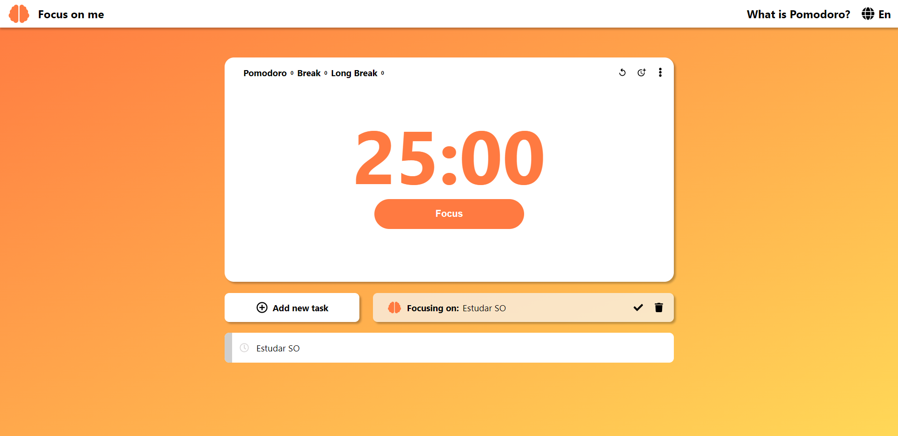

# Focus on me
## Pomodoro app to study, work, code... Let's Focus! 🕒


🔎 https://dvitorsantos.github.io/Focus-on-me/build/

 
 Run
 ---
- First, you need to run 
  ``` npm install ``` 
- Now, run ``` npm start```

 Objective
 ---
  
Be a cool and easy-to-access app, no need to login or anything like that, fully Plug and Play.
  
 Technologies
 ---
  - [React](https://reactjs.org/)
  
 Libraries
 ---
  - The React [use-sound](https://www.joshwcomeau.com/react/announcing-use-sound-react-hook/) library for sound effects 
  - The React [worker-timers](https://www.joshwcomeau.com/react/announcing-use-sound-react-hook/) library for use web-workers in setInterval() and setTimeout()
  
 Licença
 ---
 
 
 Author
 ---
  Vitor Santos 🚀
  Made with ❤️ by Vitor Santos 👋🏽 contact me!

[](mailto:vitoralannl@gmail.com)
